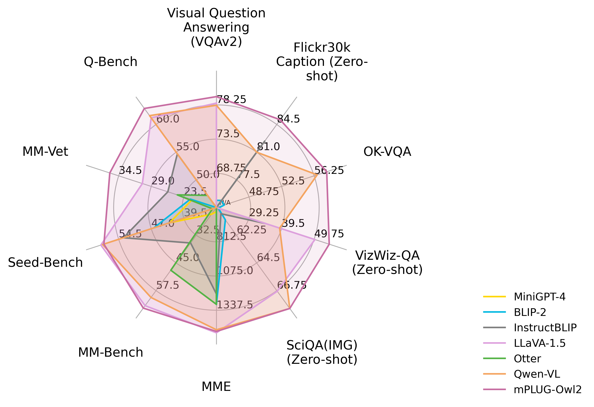

<div style="display: flex; align-items: center;">
  <h1>mPLUG-Owl2: Revolutionizing Multi-modal Large Language Model with Modality Collaboration</h1>
</div>

<div align="center">

</div>

<div align="center">
Qinghao Ye*, Haiyang Xu*, Jiabo Ye*, Ming Yan†, Anwen Hu, Haowei Liu, Qian Qi, Ji Zhang, Fei Huang, Jingren Zhou
</div>
<div align="center">
<strong>DAMO Academy, Alibaba Group</strong>
</div>
<div align="center">
*Equal Contribution; † Corresponding Author
</div>


<div align="center">
    <a href="https://huggingface.co/spaces/MAGAer13/mPLUG-Owl2"></a>
    <a href="https://modelscope.cn/studios/damo/mPLUG-Owl2/summary"></a>
    <a href="https://github.com/X-PLUG/mPLUG-Owl/blob/main/LICENSE"></a>
    <a href="http://arxiv.org/abs/2311.04257"></a>
    <a href="https://hits.seeyoufarm.com"></a>
    <a href="https://twitter.com/qinghao_ye24089"></a>
</div>

---
**mPLUG-Owl2** is the multi-modal large lanaguage model (MLLM) proposed by DAMO Academy, and it is the **first** MLLM that achieves both state-of-the-art on **pure-text** and **multi-modal** datasets with remarkable improvement. Compared to the models with similar size, mPLUG-Owl2 has surpasses the strong baseline, LLaVA-1.5 with many aspect. In addition, even with smaller vision backbone, mPLUG-Owl2 outperforms Qwen-VL largely (i.e., ViT-L(0.3B) v.s. ViT-G (1.9B)), especially on the low-level perception task (Q-Bench).
<div align="center">

</div>

## News and Updates
* ```2023.11.08``` 🔥🔥🔥 We relaese **mPLUG-Owl2** on both modelscope and Huggingface. The paper will be released soon for more details about the model, including training details and model performance.


## Performance
### General Vision-Language Benchmark Performance
<table>
<thead>
  <tr>
    <th rowspan="3"></th>
    <th rowspan="3">Method</th>
    <th rowspan="3">#Params</th>
    <th colspan="2">Image Caption</th>
    <th colspan="3">General VQA</th>
    <th colspan="3">General VQA (Zero-shot)</th>
  </tr>
  <tr>
    <th rowspan="2">COCO</th>
    <th rowspan="2">Flickr30K (Zero-shot)</th>
    <th rowspan="2">VQAv2</th>
    <th rowspan="2">OKVQA</th>
    <th rowspan="2">GQA</th>
    <th rowspan="2">VizWizQA</th>
    <th rowspan="2">TextVQA</th>
    <th rowspan="2">SciQA (IMG)</th>
  </tr>
  <tr>
  </tr>
</thead>
<tbody>
  <tr>
    <td rowspan="8">Generalists</td>
    <td>BLIP-2</td>
    <td>8.2B</td>
    <td>-</td>
    <td>74.9</td>
    <td>65.0</td>
    <td>45.9</td>
    <td>41.0</td>
    <td>19.6</td>
    <td>42.5</td>
    <td>61.0</td>
  </tr>
  <tr>
    <td>InstructBLIP</td>
    <td>8.2B</td>
    <td>102.2</td>
    <td>82.4</td>
    <td>-</td>
    <td>-</td>
    <td>49.2</td>
    <td>34.5</td>
    <td>50.1*</td>
    <td>60.5</td>
  </tr>
  <tr>
    <td>Unified-IO-XL</td>
    <td>2.9B</td>
    <td>122.3</td>
    <td>-</td>
    <td>77.9</td>
    <td>54.0</td>
    <td>-</td>
    <td>57.4**</td>
    <td>-</td>
    <td>-</td>
  </tr>
  <tr>
    <td>PaLM-E-12B</td>
    <td>12B</td>
    <td>135.0</td>
    <td>-</td>
    <td>76.2</td>
    <td>55.5</td>
    <td>-</td>
    <td>-</td>
    <td>-</td>
    <td>-</td>
  </tr>
  <tr>
    <td>Shikra</td>
    <td>7.2B</td>
    <td>117.5</td>
    <td>73.9</td>
    <td>77.4</td>
    <td>47.2</td>
    <td>-</td>
    <td>-</td>
    <td>-</td>
    <td>-</td>
  </tr>
  <tr>
    <td>LLaVA-1.5</td>
    <td>7.2B</td>
    <td>-</td>
    <td>-</td>
    <td>78.5</td>
    <td>-</td>
    <td><b>62.0</b></td>
    <td>50.0</td>
    <td>46.1/58.2*</td>
    <td>66.8</td>
  </tr>
  <tr>
    <td>Qwen-VL-Chat</td>
    <td>9.6B</td>
    <td>131.9</td>
    <td>81.0</td>
    <td>78.2</td>
    <td>56.6</td>
    <td>57.5</td>
    <td>38.9</td>
    <td>61.5**</td>
    <td>68.2</td>
  </tr>
  <tr>
    <td><b>mPLUG-Owl2</b></td>
    <td><b>8.2B</b></td>
    <td><b>137.3</b></td>
    <td><b>85.1</b></td>
    <td><b>79.4</b></td>
    <td><b>57.7</b></td>
    <td>56.1</td>
    <td><b>54.5</b></td>
    <td><b>54.3/58.2*</b></td>
    <td><b>68.7</b></td>
  </tr>
</tbody>
</table>

- `*` stands for using OCR pipeline input
- `**` denotes the model has trained on the dataset instead of zero-shot setting.
- For zero-shot image captioning, **mPLUG-Owl2** achieves the **SOTA** on Flickr30K.
- For general VQA, **mPLUG-Owl2** achieves the **SOTA** under the same generalist LVLM scale settings. Especially, **without OCR pipeline input and fine-tuning** on TextVQA, mPLUG-Owl2 has achieves remarkable performance and surpasses LLaVA-1.5 by **8.2** point.


### MLLM Benchmark (Zero-shot)
<table>
<thead>
  <tr>
    <th>Method</th>
    <th>Vision Encoder</th>
    <th>Language Model</th>
    <th>MME</th>
    <th>MMBench</th>
    <th>MM-Vet</th>
    <th>SEED-Bench</th>
    <th>Q-Bench</th>
  </tr>
</thead>
<tbody>
  <tr>
    <td>BLIP-2</td>
    <td>ViT-g (1.3B)</td>
    <td>Vicuna (7B)</td>
    <td>1293.84</td>
    <td>-</td>
    <td>22.4</td>
    <td>46.4</td>
    <td>-</td>
  </tr>
  <tr>
    <td>MiniGPT-4</td>
    <td>ViT-g (1.3B)</td>
    <td>Vicuna (7B)</td>
    <td>581.67</td>
    <td>23.0</td>
    <td>22.1</td>
    <td>42.8</td>
    <td>-</td>
  </tr>
  <tr>
    <td>LLaVA</td>
    <td>ViT-L (0.3B)</td>
    <td>Vicuna (7B)</td>
    <td>502.82</td>
    <td>36.2</td>
    <td>28.1</td>
    <td>33.5</td>
    <td>54.7</td>
  </tr>
  <tr>
    <td>mPLUG-Owl</td>
    <td>ViT-L (0.3B)</td>
    <td>LLaMA (7B)</td>
    <td>967.34</td>
    <td>46.6</td>
    <td>-</td>
    <td>34.0</td>
    <td>58.9</td>
  </tr>
  <tr>
    <td>InstructBLIP</td>
    <td>ViT-g (1.3B)</td>
    <td>Vicuna (7B)</td>
    <td>1212.82</td>
    <td>36.0</td>
    <td>26.2</td>
    <td>53.4</td>
    <td>55.8</td>
  </tr>
  <tr>
    <td>LLaMA-Adapter-v2</td>
    <td>ViT-L (0.3B)</td>
    <td>LLaMA (7B)</td>
    <td>1328.40</td>
    <td>39.5</td>
    <td>31.4</td>
    <td>32.7</td>
    <td>58.1</td>
  </tr>
  <tr>
    <td>Otter</td>
    <td>ViT-L (0.3B)</td>
    <td>LLaMA (7B)</td>
    <td>1292.26</td>
    <td>48.3</td>
    <td>24.6</td>
    <td>32.9</td>
    <td>47.2</td>
  </tr>
  <tr>
    <td>Qwen-VL-Chat</td>
    <td>ViT-G (1.9B)</td>
    <td>Qwen (7B)</td>
    <td>1487.58</td>
    <td>60.6</td>
    <td>-</td>
    <td>58.2</td>
    <td>61.6</td>
  </tr>
  <tr>
    <td>LLaVA-1.5</td>
    <td>ViT-L (0.3B)</td>
    <td>Vicuna (7B)</td>
    <td><b>1510.70</b></td>
    <td>64.3</td>
    <td>30.5</td>
    <td><b>58.6</b></td>
    <td>60.7</td>
  </tr>
  <tr>
    <td><b>mPLUG-Owl2</b></td>
    <td><b>ViT-L (0.3B)</b></td>
    <td><b>LLaMA (7B)</b></td>
    <td>1450.19</td>
    <td><b>64.5</b></td>
    <td><b>36.2</b></td>
    <td>57.8</td>
    <td><b>62.9</b></td>
  </tr>
</tbody>
</table>

### Text Benchmarks
<table>
<thead>
  <tr>
    <th>Method</th>
    <th>MMLU</th>
    <th>BBH</th>
    <th>AGIEval</th>
    <th>ARC-c</th>
    <th>ARC-e</th>
  </tr>
</thead>
<tbody>
  <tr>
    <td>LLaMA-2</td>
    <td>46.8</td>
    <td>38.2</td>
    <td>21.8</td>
    <td>40.3</td>
    <td>56.1</td>
  </tr>
  <tr>
    <td>WizardLM</td>
    <td>38.1</td>
    <td>34.7</td>
    <td>23.2</td>
    <td>47.5</td>
    <td>59.6</td>
  </tr>
  <tr>
    <td>LLaMA-2-Chat</td>
    <td>46.2</td>
    <td>35.6</td>
    <td>28.5</td>
    <td>54.9</td>
    <td>71.6</td>
  </tr>
  <tr>
    <td>Vicuna-v1.5</td>
    <td>51.1</td>
    <td>41.2</td>
    <td>21.2</td>
    <td>56.6</td>
    <td>72.8</td>
  </tr>
  <tr>
    <td><b>mPLUG-Owl2</b></td>
    <td><b>53.4</b></td>
    <td><b>45.0</b></td>
    <td><b>32.7</b></td>
    <td><b>65.8</b></td>
    <td><b>79.9</b></td>
  </tr>
</tbody>
</table>

## Checkpoints
### Huggingface Model Hub
|Model|Phase|Download link|
|-|-|-|
|mPLUG-Owl2 | Pre-training|[Download link](https://huggingface.co/MAGAer13/mplug-owl2-llama2-7b)|
|mPLUG-Owl2 |Instruction tuning|[Download link](https://huggingface.co/MAGAer13/mplug-owl2-llama2-7b)|

### Modelscope Model Hub
|Model|Phase|Download link|
|-|-|-|
|mPLUG-Owl2 | Pre-training|[Download link](https://www.modelscope.cn/models/damo/mPLUG-Owl2)|
|mPLUG-Owl2 | Instruction tuning|[Download link](https://www.modelscope.cn/models/damo/mPLUG-Owl2)|

*Note:* There might be some variation of the performance due to the conversion of the checkpoint. We do our model's training on [Megatron framework](https://github.com/NVIDIA/Megatron-LM/) with Model Parallism (MP=2) by parallalizing vision transformer, visual abstractor, and LLM, which is more efficient than using DeepSpeed Zero-3.

## Usage
### Install
1. Clone this repository and navigate to mPLUG-Owl2 folder
```bash
git clone https://github.com/X-PLUG/mPLUG-Owl.git
cd mPLUG-Owl/mPLUG-Owl2
```

2. Install Package
```Shell
conda create -n mplug_owl2 python=3.10 -y
conda activate mplug_owl2
pip install --upgrade pip
pip install -e .
```

3. Install additional packages for training cases
```
pip install -e ".[train]"
pip install flash-attn --no-build-isolation
```

### Quick Start Code
```python
import torch
from PIL import Image
from transformers import TextStreamer

from mplug_owl2.constants import IMAGE_TOKEN_INDEX, DEFAULT_IMAGE_TOKEN
from mplug_owl2.conversation import conv_templates, SeparatorStyle
from mplug_owl2.model.builder import load_pretrained_model
from mplug_owl2.mm_utils import process_images, tokenizer_image_token, get_model_name_from_path, KeywordsStoppingCriteria

image_file = '' # Image Path
model_path = 'MAGAer13/mplug-owl2-llama2-7b'
query = "Describe the image."

model_name = get_model_name_from_path(model_path)
tokenizer, model, image_processor, context_len = load_pretrained_model(model_path, None, model_name, load_8bit=False, load_4bit=False, device="cuda")

conv = conv_templates["mplug_owl2"].copy()
roles = conv.roles

image = Image.open(image_file).convert('RGB')
max_edge = max(image.size) # We recommand you to resize to squared image for BEST performance.
image = image.resize((max_edge, max_edge))

image_tensor = process_images([image], image_processor)
image_tensor = image_tensor.to(model.device, dtype=torch.float16)

inp = DEFAULT_IMAGE_TOKEN + query
conv.append_message(conv.roles[0], inp)
conv.append_message(conv.roles[1], None)
prompt = conv.get_prompt()

input_ids = tokenizer_image_token(prompt, tokenizer, IMAGE_TOKEN_INDEX, return_tensors='pt').unsqueeze(0).to(model.device)
stop_str = conv.sep2
keywords = [stop_str]
stopping_criteria = KeywordsStoppingCriteria(keywords, tokenizer, input_ids)
streamer = TextStreamer(tokenizer, skip_prompt=True, skip_special_tokens=True)

temperature = 0.7
max_new_tokens = 512

with torch.inference_mode():
    output_ids = model.generate(
        input_ids,
        images=image_tensor,
        do_sample=True,
        temperature=temperature,
        max_new_tokens=max_new_tokens,
        streamer=streamer,
        use_cache=True,
        stopping_criteria=[stopping_criteria])

outputs = tokenizer.decode(output_ids[0, input_ids.shape[1]:]).strip()
print(outputs)
```
### Gradio Web UI Setup Guide
To utilize the Gradio demo locally, follow the instructions below. If you need to compare different checkpoints with multiple model workers, remember that you only need to initiate the controller and the web server **once**.

#### How to Launch a Controller
Use the following command to start a controller:
```Shell
python -m mplug_owl2.serve.controller --host 0.0.0.0 --port 10000
```

#### How to Launch a Gradio Web Server
The next step is to launch a gradio web server using the command below:
```Shell
python -m mplug_owl2.serve.gradio_web_server --controller http://localhost:10000 --model-list-mode reload
```
This command launches the Gradio web interface. You can access the web interface using the URL displayed on your screen. Note that there will be no models listed initially, as we have not launched any model workers. The list will update automatically when a model worker is launched.

#### How to Launch a Model Worker

A model worker performs the inference on the GPU. To launch it, use the following command:

```Shell
python -m mplug_owl2.serve.model_worker --host 0.0.0.0 --controller http://localhost:10000 --port 40000 --worker http://localhost:40000 --model-path MAGAer13/mplug-owl2-llama2-7b
```
Wait until the model loading process is complete and the message "Uvicorn running on ..." appears. Refresh your Gradio web UI to see the newly launched model in the model list.

You can launch multiple workers to compare different model checkpoints within the same Gradio interface. Keep the `--controller` identical, but change the `--port` and `--worker` to different port numbers for each worker.

If you are using an Apple device with an M1 or M2 chip, you can specify the mps device by using the `--device` flag: `--device mps`.

#### How to Use Quantized Inference (4-Bit & 8-Bit)

To reduce the GPU memory footprint, you can run the inference with quantized bits (4-bit or 8-bit) by simply appending `--load-4bit` or `--load-8bit` to the **model worker** command. Here is an example of running with 4-bit quantization 

```Shell
python -m mplug_owl2.serve.model_worker --host 0.0.0.0 --controller http://localhost:10000 --port 40000 --worker http://localhost:40000 --model-path MAGAer13/mplug-owl2-llama2-7b --load-4bit
```

#### How to Launch a Model Worker with Unmerged LoRA Weights
You can launch the model worker with unmerged LoRA weights to save disk space. Here is an example:

```Shell
python -m mplug_owl2.serve.model_worker --host 0.0.0.0 --controller http://localhost:10000 --port 40000 --worker http://localhost:40000 --model-path MAGAer13/mplug-owl2-llama2-7b-lora-sft --model-base MAGAer13/mplug-owl2-llama2-7b
```

### What if I want to run demo just local?
You can use our modified `local_serve` demo, to start the demo using one-line as follows:
```Shell
python -m mplug_owl2.local_serve.local_web_server \
    --model-path MAGAer13/mplug-owl2-llama2-7b \
    --port 56789
```
You also can append `--load-4bit` or `--load-8bit` to the command if you would like to launch the demo in 4-bit or 8bit.

### CLI Inference Guide

You can chat about images using mPLUG-Owl without the Gradio interface. It also supports multiple GPUs, and 4-bit and 8-bit quantized inference. Here is an example command:

```Shell
python -m mplug_owl2.serve.cli \
    --model-path MAGAer13/mplug-owl2-llama2-7b \
    --image-file "mplug_owl2/serve/examples/extreme_ironing.jpg" \
    --load-4bit
```


## Training

Taking finetuning on LLAVA dataset as an example.

### Prepare Training Data
Please refer to [LLaVA](https://github.com/haotian-liu/LLaVA) for data preparation. Note that we do not use `<image>` as the token for image, since it would conflict with some code tags, instead we use `<|image|>` for avoiding such conflict. Besides, we also add the formatting prompt used in LLaVA-1.5 for VQA types data and Multiple Choice data as illustrated follows:
```python
question = "What's the weather like today?"
# VQA like
prompt = f"<|image|>{question}\nAnswer the question using a single word or phrase."

# Multiple Choice like
options = "A. OPTION 1\nB. OPTION 2\nC. OPTION 3"
prompt = f"<|image|>{question}\n{options}\nAnswer with the option’s letter from the given choices directly."
```

### Prepare model checkpoint

You follow the training checkpointing presented above.

### Training scripts

Training script with DeepSpeed ZeRO-3: ```scripts/finetune.sh```.

If you are do not have enough GPU memory:

- Use LoRA: ```scripts/finetune_lora.sh```. Make sure `per_device_train_batch_size*gradient_accumulation_steps` is the same as the provided script for best reproducibility.
- Replace `zero3.json` with `zero3_offload.json` which offloads some parameters to CPU RAM. This slows down the training speed.

New options to note:

- `--freeze_vision_model True`: We freeze the vision transformer by default. If you want training the vision transformer, this option should be set ```False```.
- `--tune_visual_abstractor True`: We training the visual abstractor by default. If you want freeze the abstractor, this option should be set ```False```.

## Evaluation
See Evaluation Instruction [Here](mplug_owl2/evaluate/EVALUATION.md).

## Citation

If you find mPLUG-Owl2 useful for your research and applications, please cite using this BibTeX:
```bibtex
@misc{ye2023mplugowl2,
      title={mPLUG-Owl2: Revolutionizing Multi-modal Large Language Model with Modality Collaboration}, 
      author={Qinghao Ye and Haiyang Xu and Jiabo Ye and Ming Yan and Anwen Hu and Haowei Liu and Qi Qian and Ji Zhang and Fei Huang and Jingren Zhou},
      year={2023},
      eprint={2311.04257},
      archivePrefix={arXiv},
      primaryClass={cs.CL}
}

@misc{ye2023mplugowl,
      title={mPLUG-Owl: Modularization Empowers Large Language Models with Multimodality}, 
      author={Qinghao Ye and Haiyang Xu and Guohai Xu and Jiabo Ye and Ming Yan and Yiyang Zhou and Junyang Wang and Anwen Hu and Pengcheng Shi and Yaya Shi and Chaoya Jiang and Chenliang Li and Yuanhong Xu and Hehong Chen and Junfeng Tian and Qi Qian and Ji Zhang and Fei Huang},
      year={2023},
      eprint={2304.14178},
      archivePrefix={arXiv},
      primaryClass={cs.CL}
}
```

## Acknowledgement

- [LLaVA](https://github.com/haotian-liu/LLaVA): the codebase we built upon. Thanks for the authors of LLaVA for providing the framework.


## Related Projects

* [LLaMA](https://github.com/facebookresearch/llama). A open-source collection of state-of-the-art large pre-trained language models.
* [LLaVA](https://github.com/haotian-liu/LLaVA). A visual instruction tuned vision language model which achieves GPT4 level capabilities.
* [mPLUG](https://github.com/alibaba/AliceMind/tree/main/mPLUG). A vision-language foundation model for both cross-modal understanding and generation.
* [mPLUG-2](https://github.com/alibaba/AliceMind). A multimodal model with a modular design, which inspired our project.
